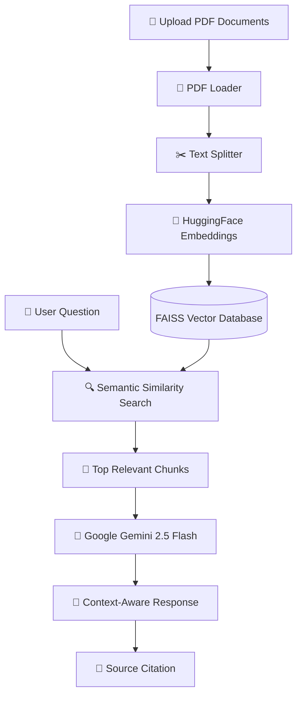
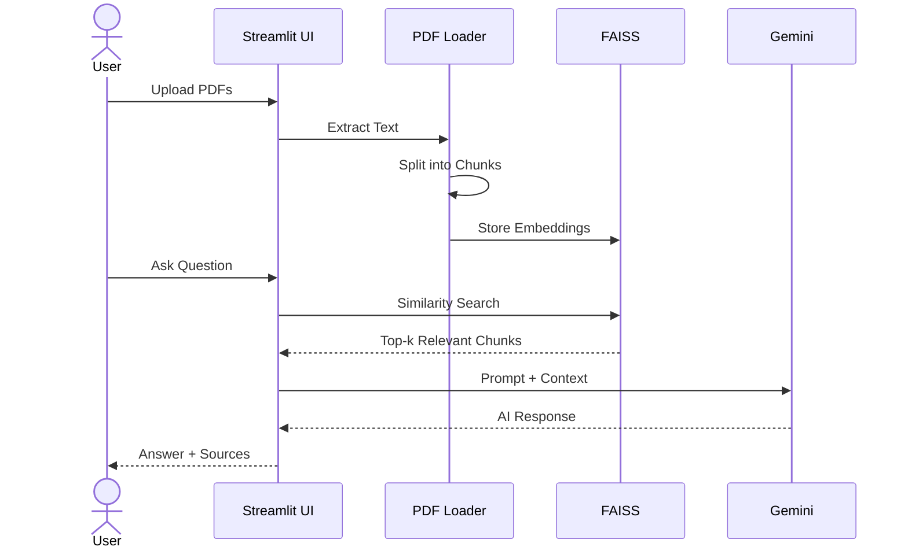

<div align="center">

# 🤖 DocMind AI

### Intelligent Multi-PDF RAG Assistant powered by Google Gemini, LangChain & FAISS

<p align="center">


</p>

### 🚀 Chat • Summarize • Compare • Translate • Generate Notes • Export

*A production-inspired Retrieval-Augmented Generation (RAG) application that enables users to intelligently interact with multiple PDF documents using semantic search and Google's Gemini Large Language Model.*

---

</div>

# 📖 Overview

**DocMind AI** is an intelligent document understanding platform that transforms static PDF files into an interactive AI-powered knowledge base.

Instead of relying on traditional keyword matching, the application performs **semantic similarity search** using **Hugging Face embeddings** and **FAISS Vector Search**, retrieving only the most relevant document chunks before passing them to **Google Gemini 2.5 Flash** for context-aware response generation.

The project demonstrates practical implementation of modern **LLM Engineering**, **Retrieval-Augmented Generation (RAG)**, **Vector Databases**, **Semantic Search**, and **Prompt Engineering** concepts through a complete end-to-end AI application.

---

# ✨ Key Features

| Feature | Description |
|----------|-------------|
| 📄 **Multi-PDF Upload** | Upload and process multiple PDF documents simultaneously |
| 🤖 **AI Question Answering** | Ask natural language questions with grounded responses |
| 🔍 **Semantic Retrieval** | FAISS retrieves the most relevant document chunks |
| 🧠 **Retrieval-Augmented Generation** | Reduces hallucinations by providing document context to Gemini |
| 📚 **Study Notes Generator** | Automatically creates structured notes from uploaded PDFs |
| 📝 **AI Summarization** | Generates concise summaries of lengthy documents |
| ⚖️ **Cross-Document Comparison** | Compare multiple PDFs side-by-side using AI |
| 🌍 **Multilingual Translation** | Translate generated responses into multiple languages |
| 📑 **Source Citation** | Displays source document and page number for transparency |
| 💾 **Chat Export** | Export complete AI conversations as PDF |
| ⚡ **Smart Vector Indexing** | Cached FAISS indexes for faster document loading |
| 🎙️ **Voice Input Interface** | UI prepared for speech-based interaction (future enhancement) |
| 🎨 **Modern UI** | Clean and responsive Streamlit interface |

---

# 🌟 Why DocMind AI?

Traditional PDF readers allow users to **search keywords**.

DocMind AI allows users to **understand knowledge**.

Instead of manually browsing hundreds of pages, users can:

- 💬 Ask questions in natural language
- 📚 Generate study material instantly
- 📄 Summarize lengthy reports
- ⚖️ Compare multiple documents
- 🌍 Translate AI-generated responses
- 📑 Verify every answer with source citations

This transforms static documents into an intelligent, conversational knowledge system.

---

# 🏗️ System Architecture



---

# 🔄 Retrieval-Augmented Generation (RAG) Pipeline


---

# ⚙️ Request Processing Workflow



---

# 🧩 Application Architecture

```text
                        ┌─────────────────────────────┐
                        │        Streamlit UI         │
                        └──────────────┬──────────────┘
                                       │
          ┌────────────────────────────┼────────────────────────────┐
          │                            │                            │
          ▼                            ▼                            ▼
  PDF Upload                  User Questions              Workflow Selection
          │                            │                            │
          └────────────────────────────┼────────────────────────────┘
                                       │
                                       ▼
                            ┌─────────────────────┐
                            │    Chat Engine      │
                            └─────────┬───────────┘
                                      │
             ┌────────────────────────┼─────────────────────────┐
             ▼                        ▼                         ▼
      PDF Loader             Text Splitter              Export Utility
             │                        │
             ▼                        ▼
      HuggingFace Embeddings      Chunked Documents
                     │
                     ▼
             FAISS Vector Store
                     │
                     ▼
          Semantic Similarity Search
                     │
                     ▼
             Google Gemini 2.5 Flash
                     │
                     ▼
      Answer • Summary • Notes • Comparison
```

---

# 📦 Core Modules

| Module | Responsibility |
|---------|----------------|
| **PDF Loader** | Extracts text and metadata from uploaded PDF files |
| **Text Splitter** | Breaks documents into semantic chunks for retrieval |
| **Embedding Engine** | Converts document chunks into dense vector embeddings |
| **Vector Store** | Stores and retrieves embeddings using FAISS |
| **Retriever** | Performs semantic similarity search |
| **LLM Engine** | Generates grounded responses using Gemini |
| **Translation Module** | Converts AI responses into multiple languages |
| **Export Utility** | Exports conversations into PDF format |

---

# 🧠 AI Workflow

```text
            PDF
             │
             ▼
      Text Extraction
             │
             ▼
      Intelligent Chunking
             │
             ▼
     Embedding Generation
             │
             ▼
      Vector Representation
             │
             ▼
      Semantic Retrieval
             │
             ▼
      Relevant Context
             │
             ▼
      Gemini LLM Reasoning
             │
             ▼
      AI Generated Answer
             │
             ▼
     Source Attribution
```

---

# 💻 Tech Stack

| Category | Technology |
|-----------|------------|
| **Programming Language** | Python 3.13 |
| **Frontend** | Streamlit |
| **Backend** | Python |
| **Framework** | LangChain |
| **Large Language Model** | Google Gemini 2.5 Flash |
| **Embedding Model** | HuggingFace all-MiniLM-L6-v2 |
| **Vector Database** | Facebook AI Similarity Search (FAISS) |
| **PDF Processing** | PyPDF |
| **Export Utility** | ReportLab |
| **Environment Management** | UV |
| **Version Control** | Git & GitHub |

---

# 📊 Feature Comparison

| Capability | Traditional PDF Reader | DocMind AI |
|------------|-----------------------|-----------|
| Read PDF | ✅ | ✅ |
| Keyword Search | ✅ | ✅ |
| Semantic Search | ❌ | ✅ |
| Ask Questions in Natural Language | ❌ | ✅ |
| Multi-PDF Understanding | ❌ | ✅ |
| AI Generated Summaries | ❌ | ✅ |
| Study Notes Generation | ❌ | ✅ |
| Cross Document Comparison | ❌ | ✅ |
| Multilingual Translation | ❌ | ✅ |
| Source Citation | ❌ | ✅ |
| Export AI Conversations | ❌ | ✅ |

---

# ⚡ Technical Highlights

✔ Retrieval-Augmented Generation (RAG)

✔ Semantic Vector Search

✔ FAISS Local Vector Database

✔ HuggingFace Sentence Embeddings

✔ Google Gemini Integration

✔ Intelligent Text Chunking

✔ Multi-PDF Context Handling

✔ Context-Aware Prompt Engineering

✔ Cached Vector Indexing

✔ Modular Backend Architecture

✔ PDF Metadata Extraction

✔ Exportable AI Conversations

✔ Responsive Streamlit Interface

---

# 🧠 AI Engineering Concepts Demonstrated

This project demonstrates practical implementation of modern Generative AI concepts, including:

- Retrieval-Augmented Generation (RAG)
- Semantic Search
- Dense Vector Embeddings
- Vector Similarity Search
- Context Window Optimization
- Prompt Engineering
- Multi-document Retrieval
- LLM Orchestration
- Intelligent Document Chunking
- Metadata-based Source Attribution
- AI-powered Knowledge Retrieval
- Context Injection using LangChain
- End-to-End AI Application Development

---

# 📈 End-to-End Data Flow

```text
               User Uploads PDFs
                       │
                       ▼
             Text Extraction Engine
                       │
                       ▼
              Intelligent Chunking
                       │
                       ▼
        HuggingFace Embedding Model
                       │
                       ▼
             High-Dimensional Vectors
                       │
                       ▼
              FAISS Vector Database
                       │
                       ▼
────────────────────────────────────────────

                User asks Question

────────────────────────────────────────────
                       │
                       ▼
          Semantic Similarity Retrieval
                       │
                       ▼
        Top-k Relevant Document Chunks
                       │
                       ▼
             Google Gemini 2.5 Flash
                       │
                       ▼
        Context-aware Response Generation
                       │
                       ▼
          Answer + Source Citations
```

---

# 🎯 Skills Demonstrated

### Artificial Intelligence

- Retrieval-Augmented Generation (RAG)
- Large Language Models
- Prompt Engineering
- Semantic Search
- Embedding Models
- Context-aware AI Systems

### Software Engineering

- Object-Oriented Programming
- Modular Architecture
- API Integration
- Error Handling
- File Processing
- Environment Management

### Machine Learning

- Sentence Embeddings
- Vector Databases
- Similarity Search
- Information Retrieval

### Development Tools

- Git
- GitHub
- UV
- Streamlit
- Python

---

# 📂 Project Structure

```text
DocMind-AI
│
├── src
│   ├── chat_engine.py
│   ├── llm.py
│   ├── vector_store.py
│   ├── embeddings.py
│   ├── pdf_loader.py
│   ├── text_splitter.py
│   └── export_utils.py
│
├── data
├── indexes
├── exported
│
├── app.py
├── pyproject.toml
├── README.md
└── .env
```

---

# 📈 Why Retrieval-Augmented Generation?

Traditional LLMs rely solely on their pre-trained knowledge, which may result in outdated information or hallucinated responses.

DocMind AI addresses this limitation using Retrieval-Augmented Generation (RAG):

1. Retrieve the most relevant document chunks using semantic search.
2. Inject only the retrieved context into the prompt.
3. Generate grounded responses using Google Gemini.
4. Display document citations for transparency and verification.

This architecture significantly improves response relevance while reducing hallucinations.

---
---

# 🚀 Installation

## Clone the Repository

```bash
git clone https://github.com/yourusername/DocMind-AI.git

cd DocMind-AI
```

---

## Create Virtual Environment

### Using UV (Recommended)

```bash
uv sync
```

### Using Pip

```bash
pip install -r requirements.txt
```

---

# 🔑 Environment Variables

Create a `.env` file inside the project root.

```env
GOOGLE_API_KEY=YOUR_GEMINI_API_KEY
```

---

# ▶️ Running the Application

Launch the Streamlit application

```bash
streamlit run app.py
```

The application will start locally at

```
http://localhost:8501
```

---

# ☁️ Deployment

DocMind AI can be deployed on multiple cloud platforms.

| Platform | Status |
|----------|--------|
| Streamlit Community Cloud | ✅ |
| Render | ✅ |
| Railway | ✅ |
| HuggingFace Spaces | ✅ |
| Docker | 🚧 Planned |

---

# 📸 Application Preview

## 🏠 Home Screen

> *(Insert Screenshot Here)*

---

## 💬 Chat Interface

> *(Insert Screenshot Here)*

---

## 📄 AI Summary

> *(Insert Screenshot Here)*

---

## ⚖️ PDF Comparison

> *(Insert Screenshot Here)*

---

## 📝 Study Notes

> *(Insert Screenshot Here)*

---

# 🎥 Demo

> *(Insert Demo GIF Here)*

Recommended:

```
demo.gif
```

Place it inside

```
assets/demo.gif
```

Then display it using

```markdown
<p align="center">


</p>
```

---

# ⚡ Performance Optimizations

DocMind AI incorporates several optimization strategies to improve efficiency and responsiveness.

| Optimization | Purpose |
|-------------|---------|
| Cached FAISS Indexes | Avoid repeated indexing for previously uploaded documents |
| Semantic Retrieval | Retrieves only relevant chunks instead of entire documents |
| Modular Backend Architecture | Improves maintainability and scalability |
| Context-aware Prompting | Reduces hallucinations by grounding responses in retrieved context |
| Source Attribution | Improves transparency and answer verification |
| Chunk-based Retrieval | Enables efficient processing of lengthy documents |

---

# 🧪 Example Workflow

```text
📄 Upload PDFs

        │

        ▼

📖 Extract Text

        │

        ▼

✂️ Split into Chunks

        │

        ▼

🧠 Generate Embeddings

        │

        ▼

🗄 Store in FAISS

        │

        ▼

💬 Ask Question

        │

        ▼

🔍 Retrieve Similar Chunks

        │

        ▼

🤖 Google Gemini

        │

        ▼

📑 Context-aware Response

        │

        ▼

📄 Source Citation
```

---

# 📌 Project Roadmap

## Completed

- ✅ Multi PDF Upload
- ✅ Semantic Search
- ✅ Google Gemini Integration
- ✅ HuggingFace Embeddings
- ✅ FAISS Vector Database
- ✅ AI Question Answering
- ✅ Study Notes Generation
- ✅ PDF Summarization
- ✅ Multi-PDF Comparison
- ✅ Multilingual Translation
- ✅ Source Citation
- ✅ Export Chat to PDF
- ✅ Cached Document Indexing
- ✅ Professional Streamlit Interface

---

## Planned

- 🚧 Voice Assistant
- 🚧 OCR for Scanned PDFs
- 🚧 Authentication
- 🚧 Chat History
- 🚧 Docker Deployment
- 🚧 Cloud Database
- 🚧 Streaming Responses
- 🚧 Highlight Answers inside PDFs
- 🚧 Citation Highlighting
- 🚧 Mobile Responsive UI

---

# 📈 Project Statistics

| Metric | Value |
|---------|-------|
| Programming Language | Python |
| AI Framework | LangChain |
| LLM | Google Gemini 2.5 Flash |
| Embedding Model | all-MiniLM-L6-v2 |
| Vector Database | FAISS |
| Supported Documents | Multiple PDFs |
| AI Features | Question Answering, Summary, Notes, Comparison, Translation |
| Architecture | Retrieval-Augmented Generation (RAG) |

---

# 🤝 Contributing

Contributions, feature requests, and suggestions are always welcome.

If you'd like to improve the project:

1. Fork the repository
2. Create a feature branch
3. Commit your changes
4. Push the branch
5. Open a Pull Request

---

# ⭐ Support

If you found this project useful,

please consider giving the repository a **⭐ Star**.

It helps the project reach more developers and motivates future improvements.

---

<div align="center">

### ⭐ Thank you for visiting DocMind AI!

*"Transforming static documents into intelligent conversations."*

</div>