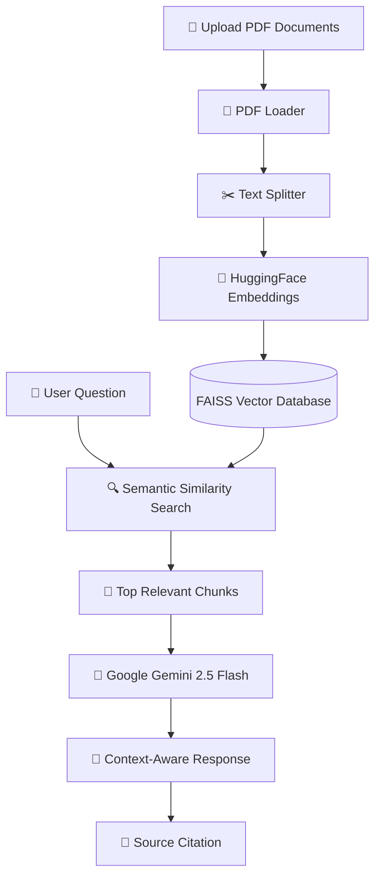

<div align="center">

# 🤖 Doc AI

### Intelligent Multi-PDF RAG Assistant powered by Google Gemini, LangChain & FAISS


### 🚀 Chat • Summarize • Compare • Translate • Generate Notes • Export

*A production-inspired Retrieval-Augmented Generation (RAG) application that enables users to intelligently interact with multiple PDF documents using semantic search and Google's Gemini Large Language Model.*

---

</div>

# 📖 Overview

**Doc AI** is an intelligent document understanding platform that transforms static PDF files into an interactive AI-powered knowledge base.

Instead of relying on traditional keyword matching, the application performs **semantic similarity search** using **Hugging Face embeddings** and **FAISS Vector Search**, retrieving only the most relevant document chunks before passing them to **Google Gemini 2.5 Flash** for context-aware response generation.

The project demonstrates practical implementation of modern **LLM Engineering**, **Retrieval-Augmented Generation (RAG)**, **Vector Databases**, **Semantic Search**, and **Prompt Engineering** concepts through a complete end-to-end AI application.

---

# ✨ Key Features

| Feature | Description |
|----------|-------------|
| 📄 **Multi-PDF Upload** | Upload and process multiple PDF documents simultaneously |
| 🤖 **AI Question Answering** | Ask natural language questions with grounded responses |
| 🔍 **Semantic Retrieval** | FAISS retrieves the most relevant document chunks |
| 🧠 **Retrieval-Augmented Generation** | Reduces hallucinations by providing document context to Gemini |
| 📚 **Study Notes Generator** | Automatically creates structured notes from uploaded PDFs |
| 📝 **AI Summarization** | Generates concise summaries of lengthy documents |
| ⚖️ **Cross-Document Comparison** | Compare multiple PDFs side-by-side using AI |
| 🌍 **Multilingual Translation** | Translate generated responses into multiple languages |
| 📑 **Source Citation** | Displays source document and page number for transparency |
| 💾 **Chat Export** | Export complete AI conversations as PDF |
| ⚡ **Smart Vector Indexing** | Cached FAISS indexes for faster document loading |
| 🎙️ **Voice Input Interface** | UI prepared for speech-based interaction (future enhancement) |
| 🎨 **Modern UI** | Clean and responsive Streamlit interface |

---

# 🏗️ System Architecture


```mermaid
flowchart TD

    A[📄 Upload PDF Documents] --> B[📖 PDF Loader]

    B --> C[✂️ Text Splitter]

    C --> D[🧠 HuggingFace Embeddings]

    D --> E[(FAISS Vector Database)]

    U[👤 User Question] --> F[🔍 Semantic Similarity Search]

    E --> F

    F --> G[📑 Top Relevant Chunks]

    G --> H[🤖 Google Gemini 2.5 Flash]

    H --> I[💬 Context-Aware Response]

    I --> J[📄 Source Citation]
```

---

# 🔄 Retrieval-Augmented Generation (RAG) Pipeline


```mermaid
flowchart LR

A[Upload PDFs]

-->

B[Extract Text]

-->

C[Split into Chunks]

-->

D[Generate Embeddings]

-->

E[Store in FAISS]

-->

F[User Query]

-->

G[Semantic Retrieval]

-->

H[Top-k Relevant Chunks]

-->

I[Gemini LLM]

-->

J[Grounded Response]
```

---

# 🧩 Application Architecture

```text
                        ┌─────────────────────────────┐
                        │        Streamlit UI         │
                        └──────────────┬──────────────┘
                                       │
          ┌────────────────────────────┼────────────────────────────┐
          │                            │                            │
          ▼                            ▼                            ▼
  PDF Upload                  User Questions              Workflow Selection
          │                            │                            │
          └────────────────────────────┼────────────────────────────┘
                                       │
                                       ▼
                            ┌─────────────────────┐
                            │    Chat Engine      │
                            └─────────┬───────────┘
                                      │
             ┌────────────────────────┼─────────────────────────┐
             ▼                        ▼                         ▼
      PDF Loader             Text Splitter              Export Utility
             │                        │
             ▼                        ▼
      HuggingFace Embeddings      Chunked Documents
                     │
                     ▼
             FAISS Vector Store
                     │
                     ▼
          Semantic Similarity Search
                     │
                     ▼
             Google Gemini 2.5 Flash
                     │
                     ▼
      Answer • Summary • Notes • Comparison
```

---

# 📦 Core Modules

| Module | Responsibility |
|---------|----------------|
| **PDF Loader** | Extracts text and metadata from uploaded PDF files |
| **Text Splitter** | Breaks documents into semantic chunks for retrieval |
| **Embedding Engine** | Converts document chunks into dense vector embeddings |
| **Vector Store** | Stores and retrieves embeddings using FAISS |
| **Retriever** | Performs semantic similarity search |
| **LLM Engine** | Generates grounded responses using Gemini |
| **Translation Module** | Converts AI responses into multiple languages |
| **Export Utility** | Exports conversations into PDF format |

---

# 💻 Tech Stack

| Category | Technology |
|-----------|------------|
| **Programming Language** | Python 3.13 |
| **Frontend** | Streamlit |
| **Backend** | Python |
| **Framework** | LangChain |
| **Large Language Model** | Google Gemini 2.5 Flash |
| **Embedding Model** | HuggingFace all-MiniLM-L6-v2 |
| **Vector Database** | Facebook AI Similarity Search (FAISS) |
| **PDF Processing** | PyPDF |
| **Export Utility** | ReportLab |
| **Environment Management** | UV |
| **Version Control** | Git & GitHub |

---

# ⚡ Technical Highlights

✔ Retrieval-Augmented Generation (RAG)

✔ Semantic Vector Search

✔ FAISS Local Vector Database

✔ HuggingFace Sentence Embeddings

✔ Google Gemini Integration

✔ Intelligent Text Chunking

✔ Multi-PDF Context Handling

✔ Context-Aware Prompt Engineering

✔ Cached Vector Indexing

✔ Modular Backend Architecture

✔ PDF Metadata Extraction

✔ Exportable AI Conversations

✔ Responsive Streamlit Interface

---
# 📈 End-to-End Data Flow

```text
               User Uploads PDFs
                       │
                       ▼
             Text Extraction Engine
                       │
                       ▼
              Intelligent Chunking
                       │
                       ▼
        HuggingFace Embedding Model
                       │
                       ▼
             High-Dimensional Vectors
                       │
                       ▼
              FAISS Vector Database
                       │
                       ▼
────────────────────────────────────────────

                User asks Question

────────────────────────────────────────────
                       │
                       ▼
          Semantic Similarity Retrieval
                       │
                       ▼
        Top-k Relevant Document Chunks
                       │
                       ▼
             Google Gemini 2.5 Flash
                       │
                       ▼
        Context-aware Response Generation
                       │
                       ▼
          Answer + Source Citations
```

# 📂 Project Structure

```text
DocMind-AI
│
├── src
│   ├── chat_engine.py
│   ├── llm.py
│   ├── vector_store.py
│   ├── embeddings.py
│   ├── pdf_loader.py
│   ├── text_splitter.py
│   └── export_utils.py
│
├── data
├── indexes
├── exported
│
├── app.py
├── pyproject.toml
├── README.md
└── .env
```
---

# 🚀 Installation

## Clone the Repository

```bash
git clone https://github.com/yourusername/DocMind-AI.git

cd DocMind-AI
```

---

## Create Virtual Environment

### Using UV (Recommended)

```bash
uv sync
```

### Using Pip

```bash
pip install -r requirements.txt
```

---

# 🔑 Environment Variables

Create a `.env` file inside the project root.

```env
GOOGLE_API_KEY=YOUR_GEMINI_API_KEY
```

---

# ▶️ Running the Application

Launch the Streamlit application

```bash
streamlit run app.py
```

The application will start locally at

```
http://localhost:8501
```
